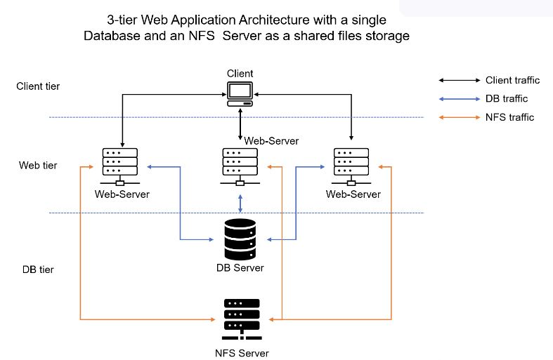
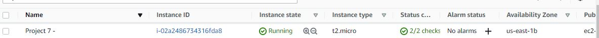

## Project-7-Devops-Tooling-Website-Solution




Task : Develop Tooling wbesite Solution

### STEP 1 – PREPARE NFS SERVER ###

- Spin up a new EC2 instance with RHEL Linux 8 Operating System.


- Configure LVM on the Server. Instead of formating the disks as `ext4` you will have to format them as `xfs`. Ensure there are 3 Logical Volumes. `lv-opt`, `lv-apps`, and `lv-logs`.


Create mount points on /mnt directory for the logical volumes as follow:

Mount `lv-apps` on /mnt/apps – To be used by webservers.

Mount `lv-logs` on /mnt/logs – To be used by webserver logs.

Mount `lv-opt` on /mnt/opt – To be used by Jenkins server.

- Install NFS server, configure it to start on reboot and make sure it is u and running,
```
sudo yum -y update
sudo yum install nfs-utils -y
sudo systemctl start nfs-server.service
sudo systemctl enable nfs-server.service
sudo systemctl status nfs-server.service
```

- Export the mounts for webservers’ `subnet cidr` to connect as clients. For simplicity, you will install your all three Web Servers inside the same subnet, but in production set up you would probably want to separate each tier inside its own subnet for higher level of security.
To check your `subnet cidr` – open your EC2 details in AWS web console and locate ‘Networking’ tab and open a Subnet link:

- Make sure  permission is setup that will allow the Web servers to read, write and execute files on NFS.
```
sudo chown -R nobody: /mnt/apps
sudo chown -R nobody: /mnt/logs
sudo chown -R nobody: /mnt/opt

sudo chmod -R 777 /mnt/apps
sudo chmod -R 777 /mnt/logs
sudo chmod -R 777 /mnt/opt

sudo systemctl restart nfs-server.service
```

- Configure access to NFS for clients within the same subnet (example of Subnet CIDR – 172.31.32.0/20 ):
