# Project 2 - LEMP Stack Implementation
___
___
## **Step 1 Installing the Nginx Web Server**
___
>### Installing Nginx using Ubuntu’s package manager ‘apt’

#####  To update a list of packages in package manager *`sudo apt update`* command is used and *`sudo apt install nginx`* command is used to install the Nginx Web Server.
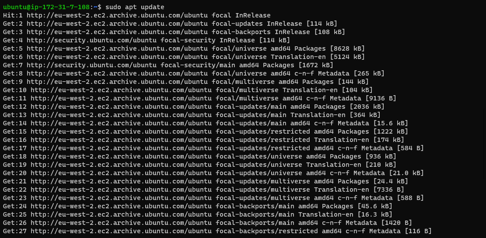

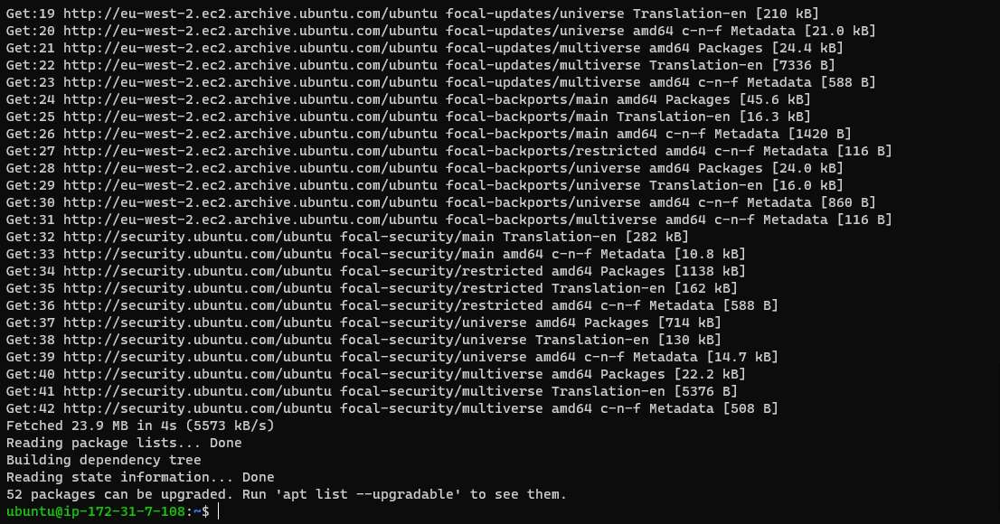
>### Installing nginx Package 

#####  To install the nginx package *`sudo apt install nginx`* command is used and below images shows the status of the running update.
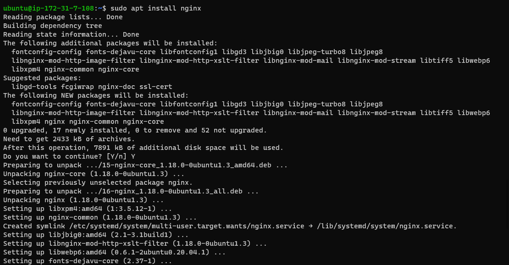
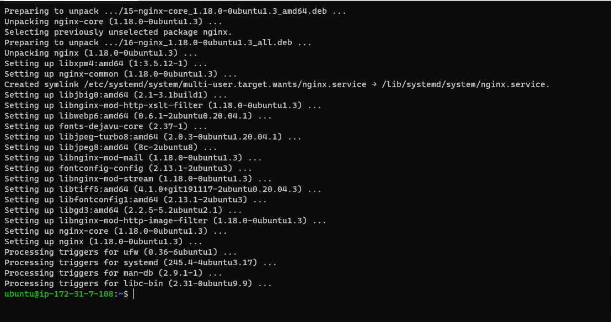
#####  The below image verifies that nginx is running as a Service on Ubuntu using command *`sudo systemctl status nginx`*
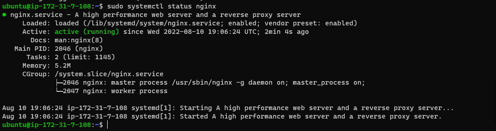
>### Testing the Newly Launch Nginx  server

#####  To Acces the Nginx Server  *`curl`* command can be used or through the CLI or a web browser by using the public IP address of the server. Below Inage shows the server page via the web browser.
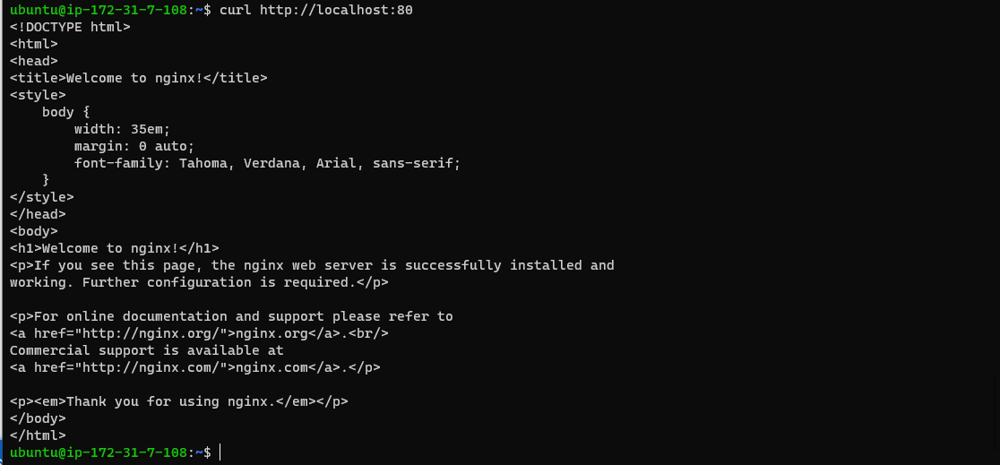

## **Step 2 INSTALLING MYSQL**
___

>### Acquiring & Installing mysql server  using ‘apt’
#####  To install the mysql *`sudo apt install mysql-server`* command is used and below images shows the status of the running update.
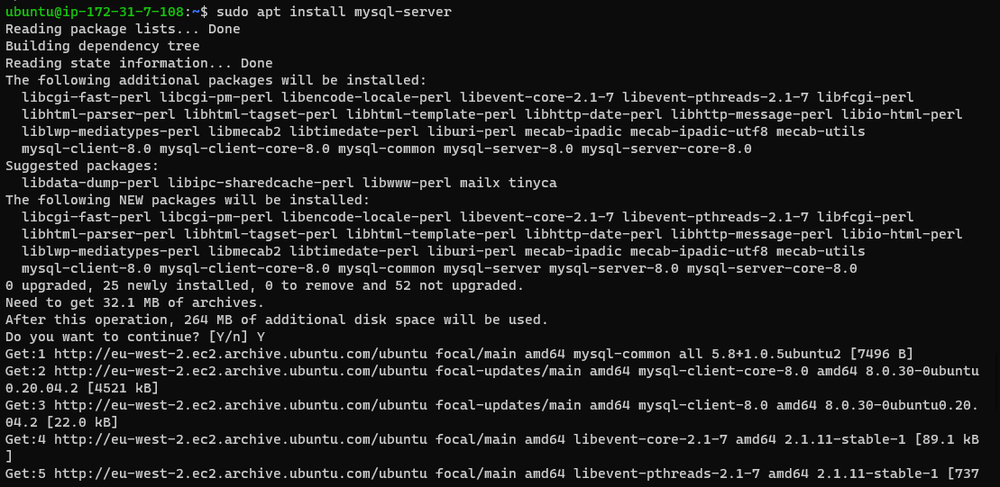
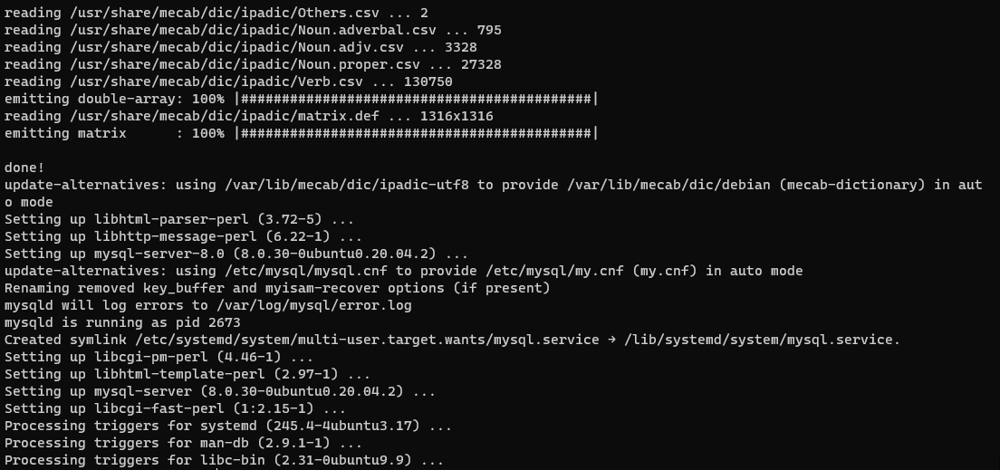
#####  To logon to mysql console *`sudo mysql`* command is used also mysql root user password is altered with *`ALTER USER 'root'@'localhost' IDENTIFIED WITH mysql_native_password BY 'PassWord.1';`* command.
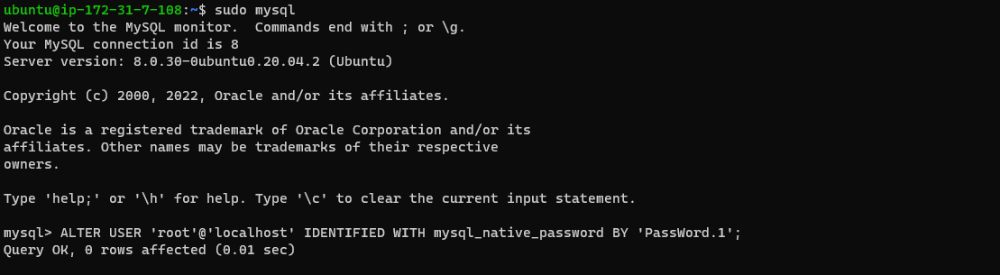
#####  To setup a secure  mysql console *`sudo mysql_secure_installation`* command is used and below images shows output of the command
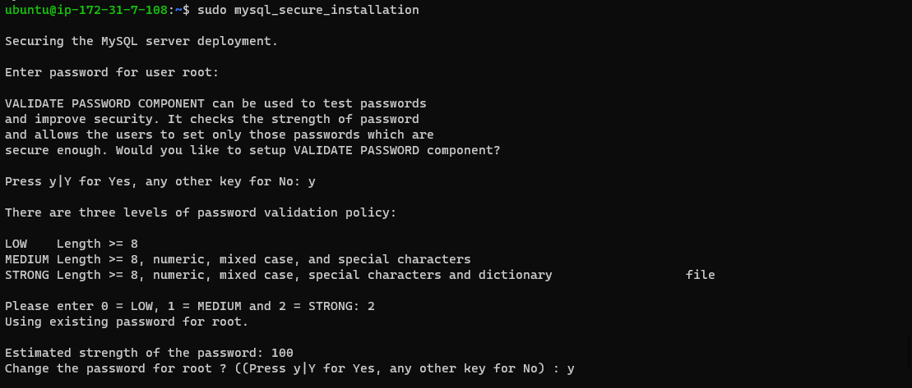
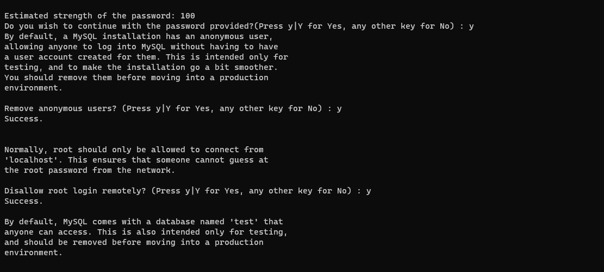
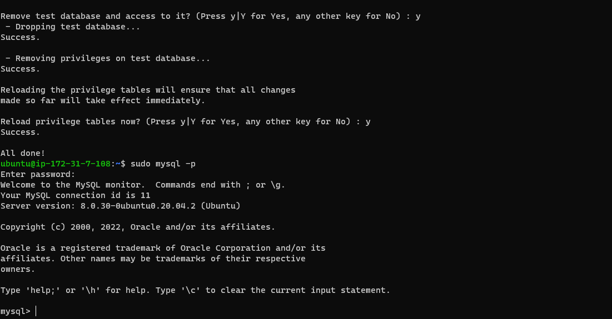
## **Step 3 INSTALLING PHP**
___
>### To have the PHP running Nginx requires an external program.
* PHP fastCGI process manager - *`php-fpm`* it bridge between the PHP interpreter itself and the web server need to be run;
* *`php-mysql`*- PHP module that allows PHP to communicate with MySQL-based databases as well. 
#####  To install all this 2 packages and other core php packages *`sudo apt install php-fpm php-mysql`* command is used and below images shows the status of the running update.
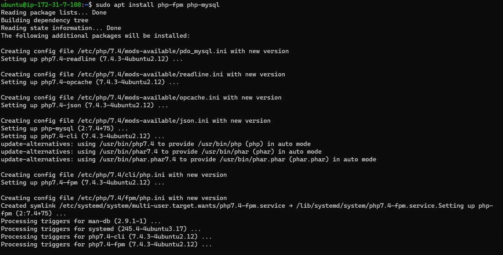

## **Step 4 CONFIGURING NGINX TO USE PHP PROCESSOR**
>### Setting up the NGINX to Create Server Blocks
#####  The following command were used to set up the server blocks to encapsulate configuration details and host more than one domain on a single server with projectLEMP as an example domain name.
* *`sudo mkdir /var/www/projectLEMP`* - (Creates a directory for Domain name  projectLEMP)
* *`sudo chown -R $USER:$USER /var/www/projectLEMP`* - (To assign ownerships of directory tp projectLEMP with ther USER envronlemt varable.)
* *`sudo nano /etc/nginx/sites-available/projectLEMP`* - (Creates a configuraton file in Nginx directory using nano line editor)
* *`sudo ln -s /etc/nginx/sites-available/projectLEMP /etc/nginx/sites-enabled/`* - (Activated configuration linked to the config file)
* *`sudo nginx -t`* - (Tests all configurations to ensure proper syntax)
* *`sudo unlink /etc/nginx/sites-enabled/default`* - (Disables default Nginx host that is currently configured)
* *`sudo systemctl reload nginx`* (Reloads Nginx to apply changes)

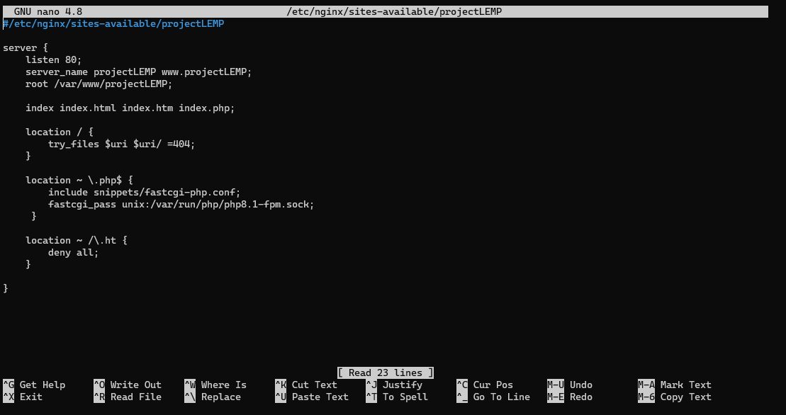

#####  Opening the Website usng *`http://<Public-IP-Address>:80`* for the Public IP and *`http://<http://<Public-DNS-Name>:80`* using the Domain Name, display page is captured below.
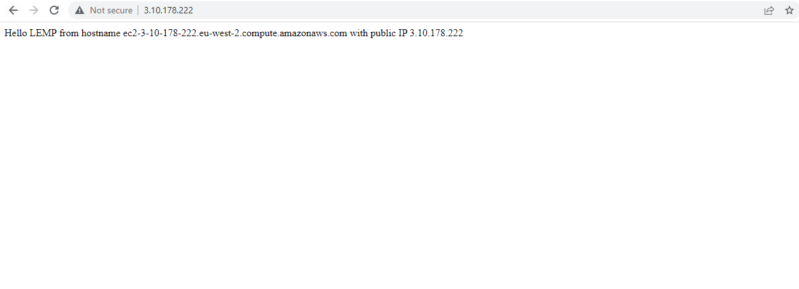
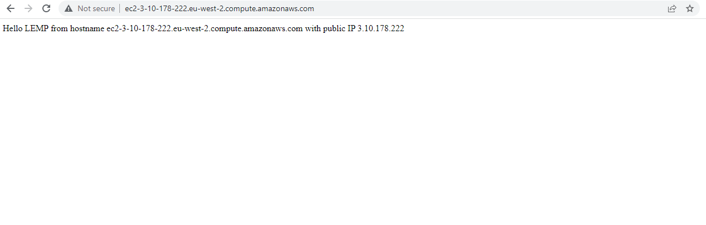
## **Step 5 TESTING PHP WITH NGINX**
>## Creating a PHP Test File
#### The following command were used to test it to validate that Nginx can correctly hand .php files off to your PHP processor.
* *`sudo nano /var/www/projectLEMP/info.php`* -  Created a test PHP file in document root

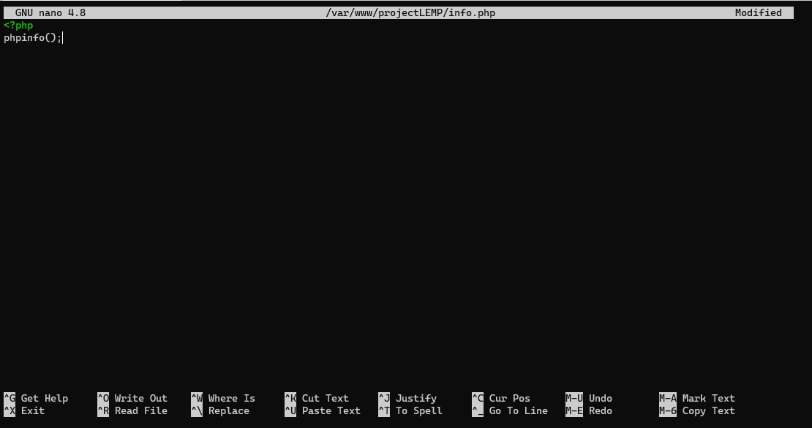
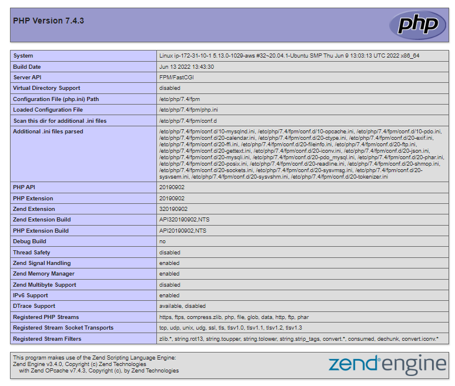
## **Step 6 RETRIEVING DATA FROM MYSQL DATABASE WITH PHP**

>### Creating a Test Database with Simple Todo List
#### The following set command were used to create the test Database and access configured  to it, so the Nginx website would be able to query data from the DB and display it.
* *`sudo mysql`* - (Connects to mysql)
* *`CREATE DATABASE `example_database`;`* - (Creates a New Database)
* *`CREATE USER 'example_user'@'%' IDENTIFIED WITH mysql_native_password BY 'password';`* - ( create a new user and grants full privileges on the database)
* *`GRANT ALL ON example_database.* TO 'example_user'@'%';`* - (Give the user permission over the specified database)
* *`SHOW DATABASES`* - (Displays the Database Table)
* *`CREATE TABLE example_database.todo_list (
item_id INT AUTO_INCREMENT,
content VARCHAR(255),
PRIMARY KEY(item_id));`* - (Create a test table named todo_list.)
* *`INSERT INTO example_database.todo_list (content) VALUES ("Input desired Values");`* (Inserts Rows in the Test table)
* *`SELECT * FROM example_database.todo_list;`* (Displays the Test table)
* *`nano /var/www/projectLEMP/todo_list.php;`* (PHP script connects to the MySQL database and queries for the content of the todo_list table)
* *`http://<Public_domain_or_IP>/todo_list.php`* -(Shows the page to display the content of the table)
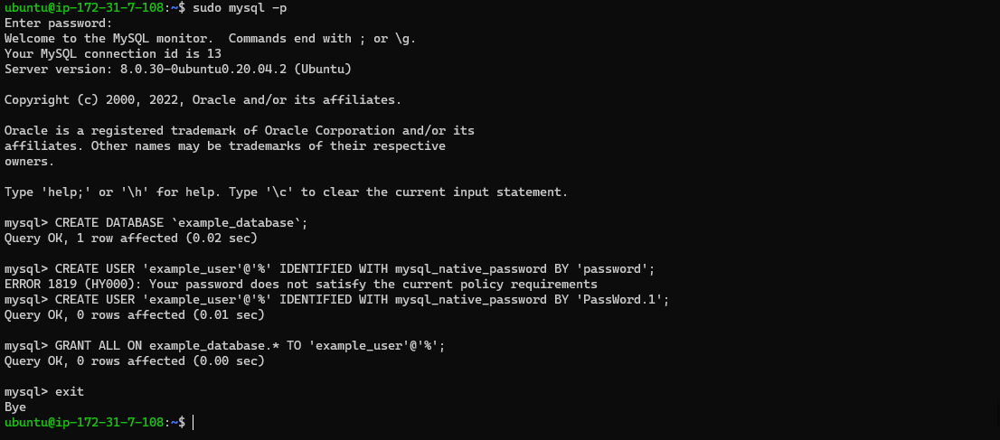

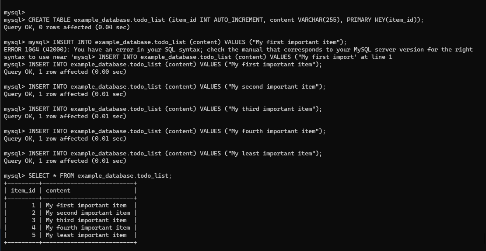
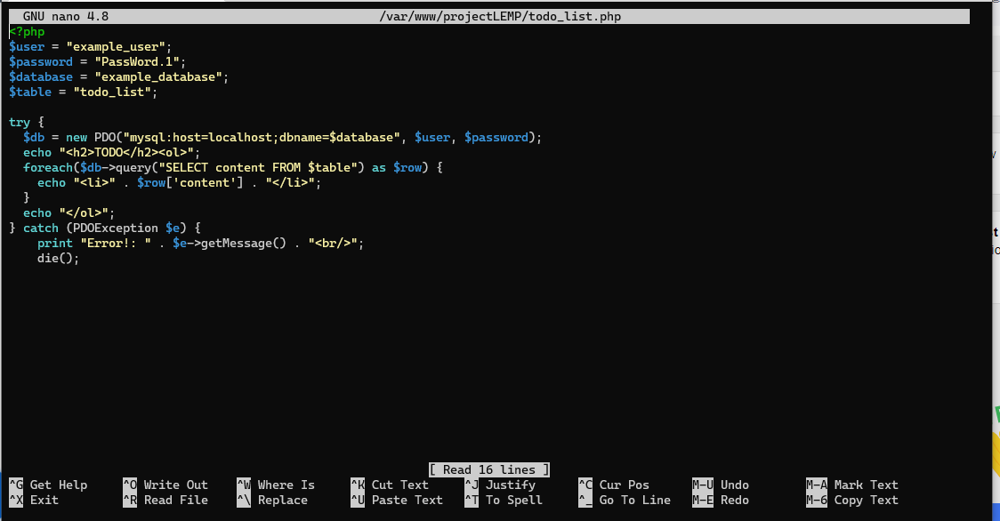
