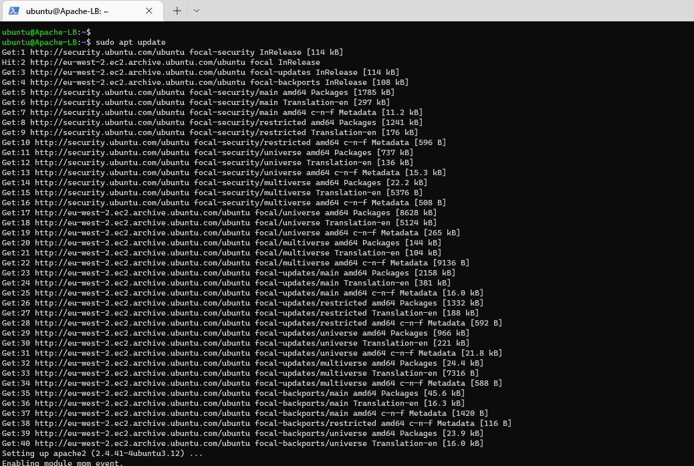
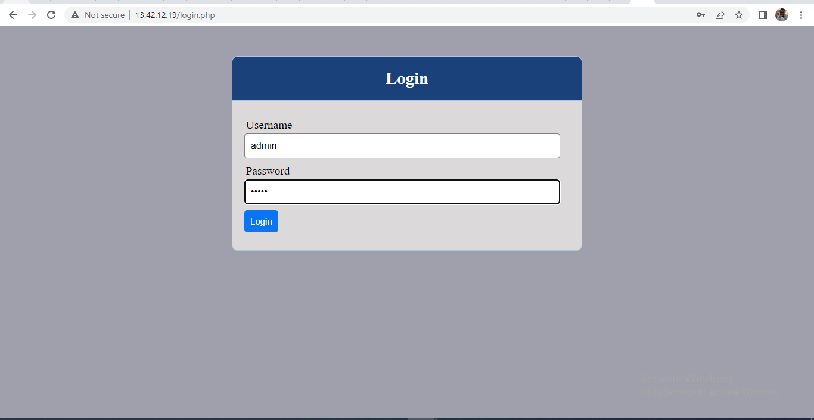
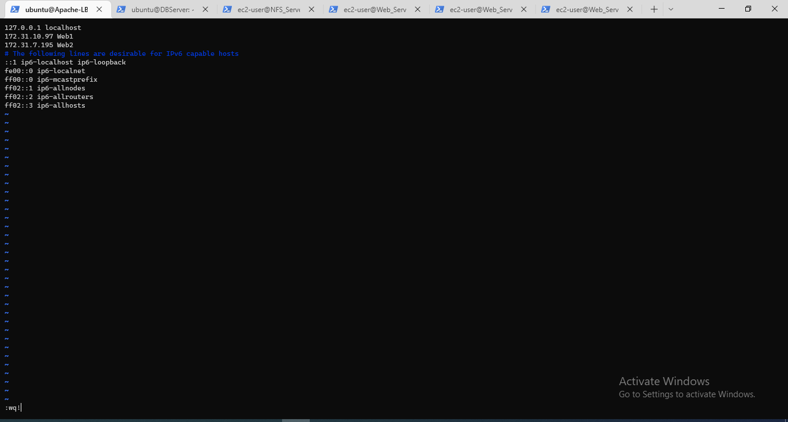
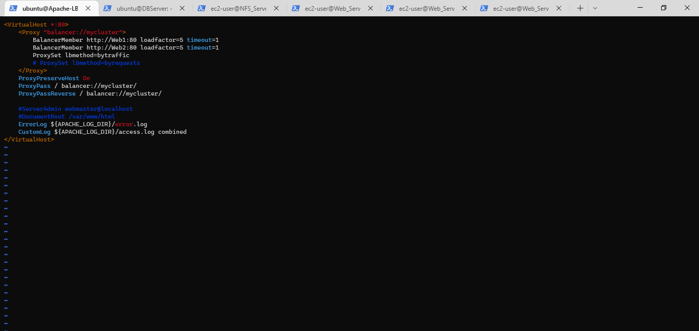
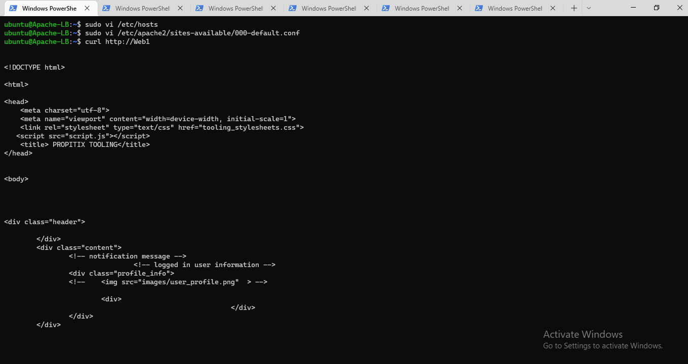
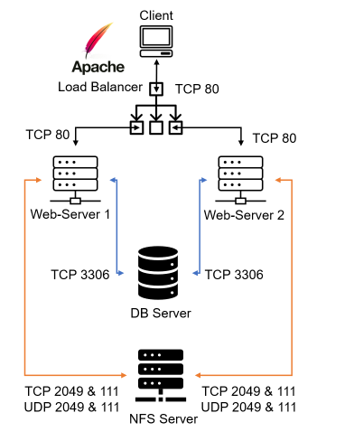

# **Project_8_Load-Balancer-Solution-With-Apache**
___
____
### **Configure Apache As A Load Balancer**
___
>#### Launch 1 EC2 instance with Ubuntu 20.04 Operating System nd name it Project-8-apache-lb  Open TCP port 80 

>#### Install Apache Load Balancer on Project-8-apache-lb server using the below commands;
##### *Install apache2:*
* *`sudo apt update`*
* *`sudo apt install apache2 -y`*
* *`sudo apt-get install libxml2-dev`*
##### *Enable following modules:*
* *`sudo a2enmod rewrite`*
* *`sudo a2enmod proxy`*
* *`sudo a2enmod proxy_balancer`*
* *`sudo a2enmod proxy_http`*
* *`sudo a2enmod headers`*
* *`sudo a2enmod lbmethod_bytraffic`*
##### *Check Status of apache2 service:
* *`sudo systemctl restart apache2`*
* *`sudo systemctl status apache2`*

>#### Configure Load Balancing
To configure LB to point traffic the Web Servers first the 000-default.conf file has to be edited using * *`sudo vi /etc/apache2/sites-available/000-default.conf`* and the below configuration data stating the details of the Web Servers will be Updated.

Balancing  method used is *bytraffic* and will distribute incoming load between your Web Servers according to current traffic load. The proportion in which traffic will be distributed is controlled by *loadfactor parameter*.

The IP address in the file are the private IP address of the Web Servers
http://172.31.10.97:80 - Web Server 1
http://172.31.7.195:80 Web Server 2

>#### Accessing the Web Server
To verify that our configuration on the LB works I access the LB from a browswer using its Public IP or Public DNS name; http://13.42.12.19/index.php

>#### Ensuring each Web Server has its own logs Directory
To make sure both servers are receiving HTTP GET requests from the Load Balancer we check the server's log file for new records.

Note: In Project 7 /var/log/httpd/ was mounted from Web Servers to the /mnt/logs on NFS server. For this test we unmount it to make sure that each Web Server has its own log directory using 
* *`sudo umount -f /var/log/httpd/`* - To Unmount
* *`sudo tail -f /var/log/httpd/access_log`* - To check the log Files

The LB browser page was refreshed several times so as ti be sure that both webservers receive HTTP GET requests from your LB – new records are updated in each server’s log file. The number of requests to each server will be distributed evenly since the value of the loadfactor is the same for both servers.
>#### Configure Local DNS Names Resolution for the 2 webservers on the loadbalancer server
By editing the /etc/hosts file on LB server, IP address to domain name mapping be configured. File is Opened with and edit.
* *`sudo vi /etc/hosts`* - Opens the file to edit host *WebServer1-Private-IP-Address* with **Web1** &  *WebServer2-Private-IP-Address* with **Web2**

Update the LB config file with those names instead of IP addresses;
* *`sudo vi /etc/apache2/sites-available/000-default.conf`* - Opens file and to edit BalancerMember http://Web1:80 loadfactor=5 timeout=1  and BalancerMember http://Web2:80 loadfactor=5 timeout=1.

As an internal configuration it only applies to the loadbalancer server not accessible on the intenet. Try to curl the Web Servers from LB locally.

curl http://Web1 or curl http://Web2

#### Traget Architecture Setup

