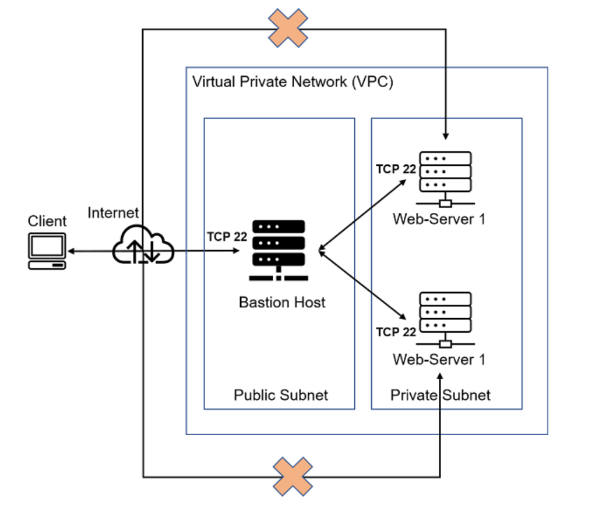

# INSTALL-AND-CONFIGURE-ANSIBLE-ON-EC2-INSTANCE

On the diagram below the Virtual Private Network (VPC) is divided into two subnets – Public subnet has public IP addresses and Private subnet is only reachable by private IP addresses.

**Task**
- Install and configure Ansible client to act as a Jump Server/Bastion Host
- Create a simple Ansible playbook to automate servers configuration

