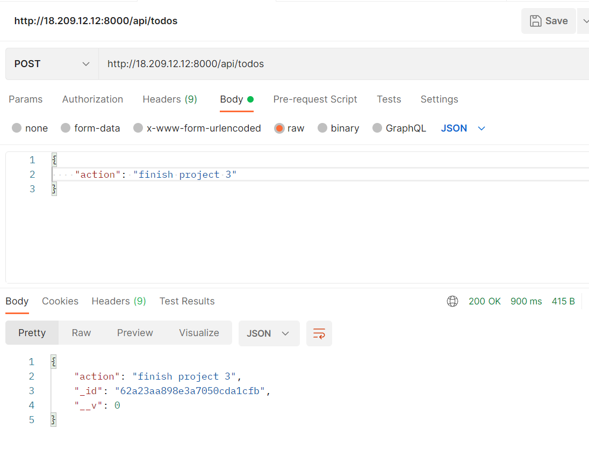
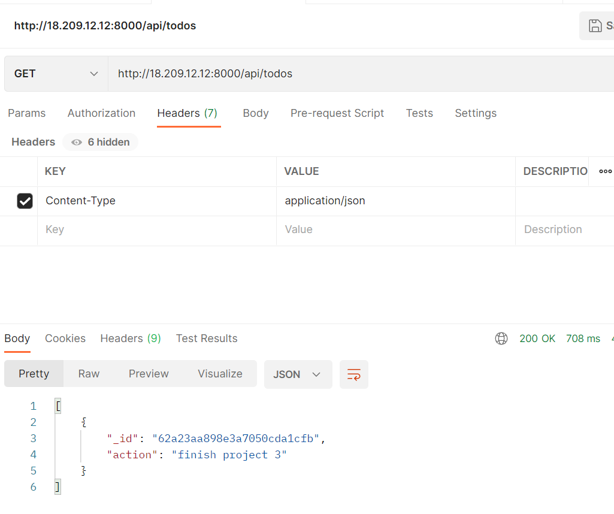
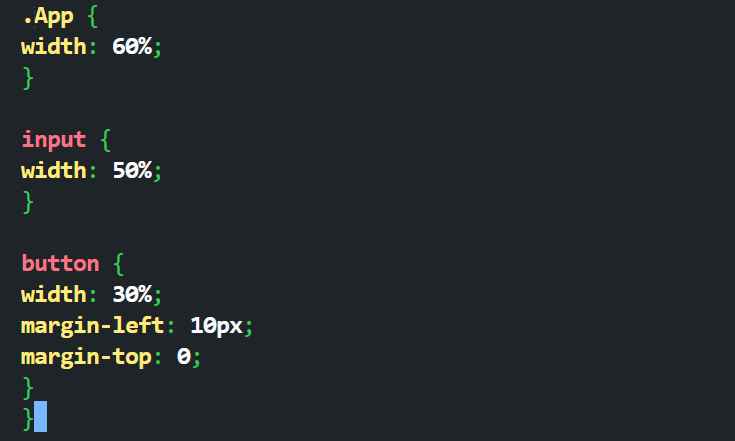
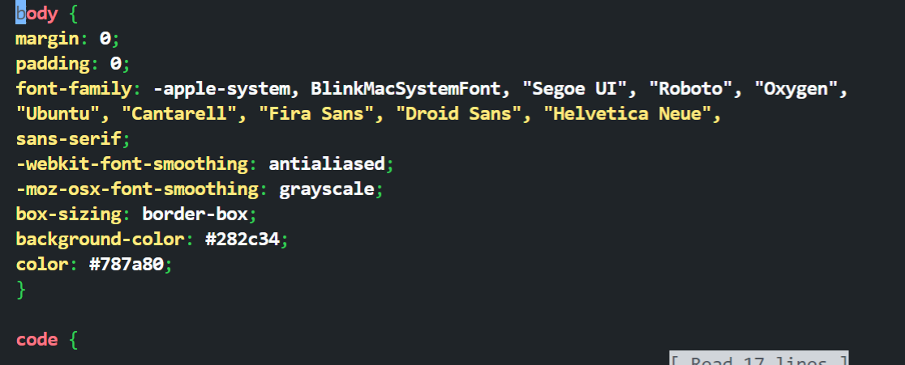
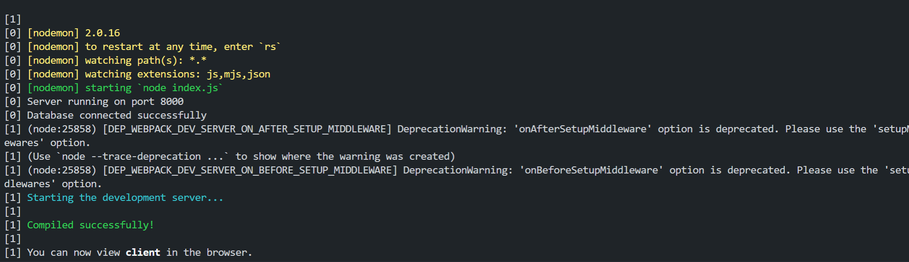
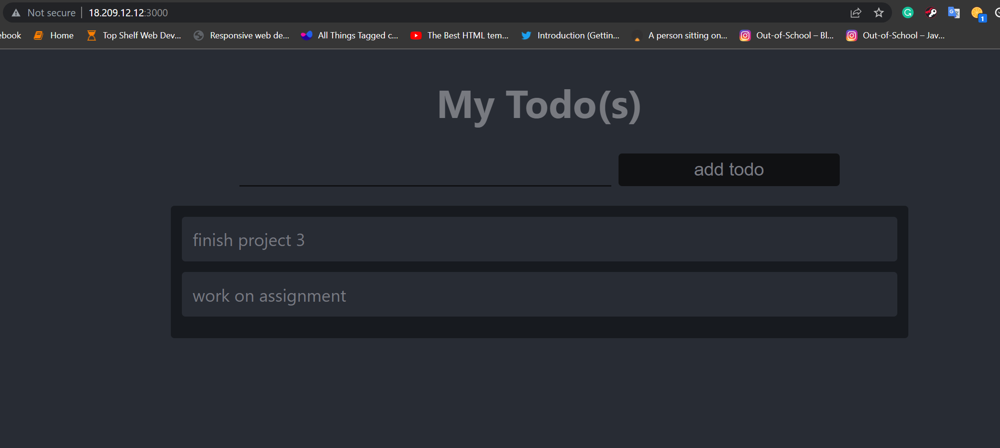

# SIMPLE TO-DO APPLICATION ON MERN WEB STACK

In this project we would be implementing a simple to-do application on MERN stack on an AWS EC2 instance. And we would be performing the following functions:
- backend configuration
- Install expressjs
- Models
- Mongodb database
- frontend creation
- Frontend creation (continued)

## Backend Configuration
Here we would begin by configuring the backend for our to-do app.

- update ubuntu on the instance.
    ```
    sudo apt update
    ```

    

- upgrade ubuntu on the instance
    ```
    sudo apt upgrade
    ```

   

- Get the location of Node.js software from Ubuntu repositories.
    ```
    curl -fsSL https://deb.nodesource.com/setup_18.x | sudo -E bash -
    ```


- Installing Node.js on the server
    ```
    sudo apt install nodejs
    ```


    Note: The command above installs both nodejs and npm. NPM is a package manager for Node like apt for Ubuntu, it is used to install Node modules & packages and to manage dependency conflicts.

- verify node installation
    ```
    node -v
    ```

    
    Note: The command above verifies that nodejs is installed on the server.

- verify npm installation
    ```
    npm -v
    ```

  
    Note: The command above verifies that npm is installed on the server.

- Application Code Setup
    We would need to create a new directory for our To-Do project:

    ```
    mkdir Todo
    ```

    

- Run the command below to verify that the Todo directory is created with ls command
    ```
    ls
    ```

 

    Note: The command above verifies that the Todo directory is created with ls command.

- Now we change our current directory to the newly created one
    ```
    cd Todo
    ```

    Results:
    

- Next, we will use the command npm init to initialise our project, so that a new file named package.json will be created. This file will normally contain information about our application and the dependencies that it needs to run. Follow the prompts after running the command. We would press Enter several times to accept default values, then accept to write out the package.json file by typing yes.

    ```
    npm init
    ```


    Note: The command above initialises our project.


## Install ExpressJS
Now we would move on with installing express js.

- To use express, install it using npm.
    ```
    npm install express
    ```

  

    Note: The command above installs expressjs.

- Now create a file index.js with the command below.
    ```
    touch index.js
    ```


    Note: The command above creates a file index.js and run ls to confirm that your index.js file is successfully created

- Install the dotenv module
    ```
    npm install dotenv
    ```

 

    Note: The command above installs the dotenv module.

- Open the index.js file with the command below.
    ```
    vim index.js
    ```
    and paste the following code:
    ```
    const express = require('express');
    require('dotenv').config();

    const app = express();

    const port = process.env.PORT || 8000;

    app.use((req, res, next) => {
    res.header("Access-Control-Allow-Origin", "\*");
    res.header("Access-Control-Allow-Headers", "Origin, X-Requested-With, Content-Type, Accept");
    next();
    });

    app.use((req, res, next) => {
    res.send('Welcome to Express');
    });

    app.listen(port, () => {
    console.log(`Server running on port ${port}`)
    });
    ```

   

    Note: The command above opens the index.js file.

- Now it is time to start our server to see if it works. Open your terminal in the same directory as your index.js file and type the following command:
    ```
    node index.js
    ```

    
    Note: The command above starts our server.

- Open up your browser and try to access your server’s Public IP or Public DNS name followed by port 8000
    ```
    http://<ip-address>:8000
    ```

    

    Note: The command above opens up your browser and try to access your server’s Public IP or Public DNS name followed by port 8000.

### Routes
There are three actions that our To-Do application needs to be able to do:

Create a new task
Display list of all tasks
Delete a completed task
Each task will be associated with some particular endpoint and will use different standard HTTP request methods: POST, GET, DELETE.

- For each task, we need to create routes that will define various endpoints that the To-do app will depend on. 

    So let us create a folder routes and change directory to the routes folder
    ```
    mkdir routes
    cd routes
    ```

 
    Note: The command above creates a folder routes and helps us change directory into that created folder.

- Now, create a file api.js with the command below.
    ```
    touch api.js
    ```

  
    Note: The command above creates a file api.js and run ls to confirm that your api.js file is successfully created

- Open the file with the command below
    ```
    nano api.js
    ```
    and paste the following code:
    ```
    const express = require ('express');
    const router = express.Router();

    router.get('/todos', (req, res, next) => {

    });

    router.post('/todos', (req, res, next) => {

    });

    router.delete('/todos/:id', (req, res, next) => {

    })

    module.exports = router;
    ```

  

## Models
Moving forward let's create Models directory.

Since the app is going to make use of Mongodb which is a NoSQL database, we need to create a model.

A model is at the heart of JavaScript based applications, and it is what makes it interactive.

We will also use models to define the database schema . This is important so that we will be able to define the fields stored in each Mongodb document
In essence, the Schema is a blueprint of how the database will be constructed, including other data fields that may not be required to be stored in the database. These are known as virtual properties

To create a Schema and a model, install mongoose which is a Node.js package that makes working with mongodb easier.

- To use mongoose, install it using npm.
    ```
    npm install mongoose
    ```

    

    Note: The command above installs mongoose.

- Create a new folder models and change directory into the newly created models folder.
    ```
    mkdir models
    cd models
    ```

  
    Note: The command above creates a folder models and helps us change directory into that created folder.

- Inside the models folder, create a file and name it todo.js
    ```
    touch todo.js
    ```

   

    Note: The command above creates a file todo.js and run ls to confirm that your todo.js file is successfully created

- Open the file created with vim todo.js then paste the code below in the file
    ```
    const mongoose = require('mongoose');
    const Schema = mongoose.Schema;

    //create schema for todo
    const TodoSchema = new Schema({
    action: {
    type: String,
    required: [true, 'The todo text field is required']
    }
    })

    //create model for todo
    const Todo = mongoose.model('todo', TodoSchema);

    module.exports = Todo;
    ```

    

    Note: The command above opens the file todo.js and then you paste the code below in the file.

- Now we need to update our routes from the file api.js in ‘routes’ directory to make use of the new model.

    In Routes directory, open api.js with vim api.js, delete the code inside with :%d command and paste there code below into it then save and exit

    ```
    const express = require ('express');
    const router = express.Router();
    const Todo = require('../models/todo');

    router.get('/todos', (req, res, next) => {

    //this will return all the data, exposing only the id and action field to the client
    Todo.find({}, 'action')
    .then(data => res.json(data))
    .catch(next)
    });

    router.post('/todos', (req, res, next) => {
    if(req.body.action){
    Todo.create(req.body)
    .then(data => res.json(data))
    .catch(next)
    }else {
    res.json({
    error: "The input field is empty"
    })
    }
    });

    router.delete('/todos/:id', (req, res, next) => {
    Todo.findOneAndDelete({"_id": req.params.id})
    .then(data => res.json(data))
    .catch(next)
    })

    module.exports = router;
    ```

   


## MONGODB Database
MongoDB Database
We need a database where we will store our data. For this we will make use of mLab. mLab provides MongoDB database as a service solution (DBaaS), so to make life easy, you will need to sign up for a shared clusters free account, which is ideal for our use case. Sign up here. Follow the sign up process, select AWS as the cloud provider, and choose a region near you.

- create an account and complete the checklist
    - Create a MongoDB database and collection inside mLab
    - Allow access to the MongoDB database from anywhere (Not secure, but it is ideal for testing)
    
   

In the index.js file, we specified process.env to access environment variables, but we have not yet created this file. So we need to do that now.

- we would create a file in our Todo directory and name it .env.
    ```
    touch .env
    nano .env
    ```
    And add the connection string to access the database in it, just as below:
    ```
    DB = 'mongodb+srv://<username>:<password>@<network-address>/<dbname>?retryWrites=true&w=majority'
    ```
    ```Ensure to update <username>, <password>, <network-address> and <database> according to your setup```

  
    Note: The command above creates a file .env and run ls to confirm that your .env file is successfully created.

- Now we need to update the index.js to reflect the use of .env so that Node.js can connect to the database.
    ```
    const express = require('express');
    const bodyParser = require('body-parser');
    const mongoose = require('mongoose');
    const routes = require('./routes/api');
    const path = require('path');
    require('dotenv').config();

    const app = express();

    const port = process.env.PORT || 5000;

    //connect to the database
    mongoose.connect(process.env.DB, { useNewUrlParser: true, useUnifiedTopology: true })
    .then(() => console.log(`Database connected successfully`))
    .catch(err => console.log(err));

    //since mongoose promise is depreciated, we overide it with node's promise
    mongoose.Promise = global.Promise;

    app.use((req, res, next) => {
    res.header("Access-Control-Allow-Origin", "\*");
    res.header("Access-Control-Allow-Headers", "Origin, X-Requested-With, Content-Type, Accept");
    next();
    });

    app.use(bodyParser.json());

    app.use('/api', routes);

    app.use((err, req, res, next) => {
    console.log(err);
    next();
    });

    app.listen(port, () => {
    console.log(`Server running on port ${port}`)
    });
    ```

    
    Note: We're using environment variables to store information is considered more secure and best practice to separate configuration and secret data from the application, instead of writing connection strings directly inside the index.js application file

- Start your server using the command:
    ```
    node index.js
    ```

   
    Note: We should see a message ‘Database connected successfully’, if so – we have our backend configured. Now we are going to test it.

### Testing Backend Code without Frontend using RESTful API
So far we have written backend part of our To-Do application, and configured a database, but we do not have a frontend UI yet. We need ReactJS code to achieve that. But during development, we will need a way to test our code using RESTfulL API. Therefore, we will need to make use of some API development client to test our code.

- we would be installing postman on our local machine and we would test all the API endpoints and make sure they are working. For the endpoints that require body, you should send JSON back with the necessary fields since it’s what we setup in our code.

- Now open your Postman, create a POST request to the API http://<PublicIP-or-PublicDNS>:5000/api/todos. This request sends a new task to our To-Do list so the application could store it in the database.
    ```
    POST http://<PublicIP-or-PublicDNS>:8000/api/todos
    ```
    Results:
    
    Note: make sure your set header key Content-Type as application/json

- Create a GET request to your API on http://<PublicIP-or-PublicDNS>:5000/api/todos. This request retrieves all existing records from out To-do application (backend requests these records from the database and sends it us back as a response to GET request).
    ```
    GET http://<PublicIP-or-PublicDNS>:8000/api/todos
    ```
    Results:
    
    Note: make sure your set header key Content-Type as application/json


## Frontend Development
Since we are done with the functionality we want from our backend and API, it is time to create a user interface for a Web client (browser) to interact with the application via API. To start out with the frontend of the To-do app, we will use the create-react-app command to scaffold our app

- In the same root directory as your backend code, which is the Todo directory, run
    ```
     npx create-react-app client
    ```
  

    Note: This will create a new folder in your Todo directory called client, where you will add all the react code.

### Running a React App
Before testing the react app, there are some dependencies that need to be installed.

- Install concurrently. It is used to run more than one command simultaneously from the same terminal window
    ```
    npm install concurrently --save-dev
    ```
 
- Install nodemon. It is used to run and monitor the server. If there is any change in the server code, nodemon will restart it automatically and load the new changes.
    ```
    npm install nodemon --save-dev
    ```
   

- In Todo folder open the package.json file. Change the highlighted part of the below screenshot and replace with the code below.
    ```
    "scripts": {
        "start": "node index.js",
        "start-watch": "nodemon index.js",
        "dev": "concurrently \"npm run start-watch\" \"cd client && npm start\""
    },

    ```
  

### Configure Proxy in package.json
- Change directory to ‘client’
    ```
    cd client
    ```
    

- Open the package.json file
    ```
    nano package.json
    ```

    

- Add the key value pair in the package.json file "proxy": "http://localhost:8000"
    ```
    "proxy": "http://localhost:8000"
    ```
   

    Note: The whole purpose of adding the proxy configuration is to make it possible to access the application directly from the browser by simply calling the server url like http://localhost:8000 rather than always including the entire path like http://localhost:8000/api/todos

- Now, ensure you are inside the Todo directory, and simply do
    ```
    npm run dev
    ```

  

- Your app should open and start running on localhost:3000
    ```
    http://localhost:3000
    ```
  

### Creating our React Components
One of the advantages of react is that it makes use of components, which are reusable and also makes code modular. For our Todo app, there will be two stateful components and one stateless component.

- From our Todo directory run
    ```
    cd client
    ```


    Note: This will change the directory to the client folder.

- move into the src directory
    ```
    cd src
    ```
  

- Inside our src folder create another folder called components
    ```
    mkdir components
    ```
 

- Move into the components directory with
    ```
    cd components
    ```
 


    Note: This will change the directory to the components folder.

- Inside ‘components’ directory create three files Input.js, ListTodo.js and Todo.js
    ```
    touch Input.js
    touch ListTodo.js
    touch Todo.js
    ```
   

- Open Input.js file
    ```
    nano Input.js
    ```
    and paste the following code:
    ```
    import React, { Component } from 'react';
    import axios from 'axios';

    class Input extends Component {

    state = {
    action: ""
    }

    addTodo = () => {
    const task = {action: this.state.action}

        if(task.action && task.action.length > 0){
        axios.post('/api/todos', task)
            .then(res => {
            if(res.data){
                this.props.getTodos();
                this.setState({action: ""})
            }
            })
            .catch(err => console.log(err))
        }else {
        console.log('input field required')
        }

    }

    handleChange = (e) => {
    this.setState({
    action: e.target.value
    })
    }

    render() {
    let { action } = this.state;
    return (
    <div>
    <input type="text" onChange={this.handleChange} value={action} />
    <button onClick={this.addTodo}>add todo</button>
    </div>
    )
    }
    }

    export default Input
    ```

   

To make use of Axios, which is a Promise based HTTP client for the browser and node.js, you need to cd into your client from your terminal and run yarn add axios or npm install axios.

- install axios
    ```
    npm install axios
    ```


- Go to ‘components’ directory
    ```
    cd components
    ```
  
- After that open your ListTodo.js
    ```
    nano ListTodo.js
    ```
    and paste the following
    ```
    import React from 'react';

    const ListTodo = ({ todos, deleteTodo }) => {

    return (
    <ul>
    {
    todos &&
    todos.length > 0 ?
    (
    todos.map(todo => {
    return (
    <li key={todo._id} onClick={() => deleteTodo(todo._id)}>{todo.action}</li>
    )
    })
    )
    :
    (
    <li>No todo(s) left</li>
    )
    }
    </ul>
    )
    }

    export default ListTodo
    ```

    

- Then in your Todo.js file you write the following code
    ```
    import React, {Component} from 'react';
    import axios from 'axios';

    import Input from './Input';
    import ListTodo from './ListTodo';

    class Todo extends Component {

    state = {
    todos: []
    }

    componentDidMount(){
    this.getTodos();
    }

    getTodos = () => {
    axios.get('/api/todos')
    .then(res => {
    if(res.data){
    this.setState({
    todos: res.data
    })
    }
    })
    .catch(err => console.log(err))
    }

    deleteTodo = (id) => {

        axios.delete(`/api/todos/${id}`)
        .then(res => {
            if(res.data){
            this.getTodos()
            }
        })
        .catch(err => console.log(err))

    }

    render() {
    let { todos } = this.state;

        return(
        <div>
            <h1>My Todo(s)</h1>
            <Input getTodos={this.getTodos}/>
            <ListTodo todos={todos} deleteTodo={this.deleteTodo}/>
        </div>
        )

    }
    }

    export default Todo;
    ```

    

- We need to make little adjustment to our react code. Delete the logo and adjust our App.js file, move to the src folder and open App.js file.
    ```
    nano App.js
    ```

    and paste the following code:
    ```
    import React from 'react';

    import Todo from './components/Todo';
    import './App.css';

    const App = () => {
    return (
    <div className="App">
    <Todo />
    </div>
    );
    }

    export default App;
    ```

    

- then edit the App.css file and paste the following code:
    ```
    .App {
    text-align: center;
    font-size: calc(10px + 2vmin);
    width: 60%;
    margin-left: auto;
    margin-right: auto;
    }

    input {
    height: 40px;
    width: 50%;
    border: none;
    border-bottom: 2px #101113 solid;
    background: none;
    font-size: 1.5rem;
    color: #787a80;
    }

    input:focus {
    outline: none;
    }

    button {
    width: 25%;
    height: 45px;
    border: none;
    margin-left: 10px;
    font-size: 25px;
    background: #101113;
    border-radius: 5px;
    color: #787a80;
    cursor: pointer;
    }

    button:focus {
    outline: none;
    }

    ul {
    list-style: none;
    text-align: left;
    padding: 15px;
    background: #171a1f;
    border-radius: 5px;
    }

    li {
    padding: 15px;
    font-size: 1.5rem;
    margin-bottom: 15px;
    background: #282c34;
    border-radius: 5px;
    overflow-wrap: break-word;
    cursor: pointer;
    }

    @media only screen and (min-width: 300px) {
    .App {
    width: 80%;
    }

    input {
    width: 100%
    }

    button {
    width: 100%;
    margin-top: 15px;
    margin-left: 0;
    }
    }

    @media only screen and (min-width: 640px) {
    .App {
    width: 60%;
    }

    input {
    width: 50%;
    }

    button {
    width: 30%;
    margin-left: 10px;
    margin-top: 0;
    }
    }
    ```
    Results:
    

- we would then need to open the index.css file and paste the following code:
    ```
   body {
    margin: 0;
    padding: 0;
    font-family: -apple-system, BlinkMacSystemFont, "Segoe UI", "Roboto", "Oxygen",
    "Ubuntu", "Cantarell", "Fira Sans", "Droid Sans", "Helvetica Neue",
    sans-serif;
    -webkit-font-smoothing: antialiased;
    -moz-osx-font-smoothing: grayscale;
    box-sizing: border-box;
    background-color: #282c34;
    color: #787a80;
    }

    code {
    font-family: source-code-pro, Menlo, Monaco, Consolas, "Courier New",
    monospace;
    }
    ```
    Results:
    

- Then navigate back to the Todo directory and run
    ```
    npm run dev
    ```

    Results:
    

- Then open your browser and navigate to http://localhost:3000/
    ```
    http://localhost:3000/
    ```
    <!-- Results:
     -->

    - You should see a list of todos.
    - You should be able to add a todo.
    - finished
